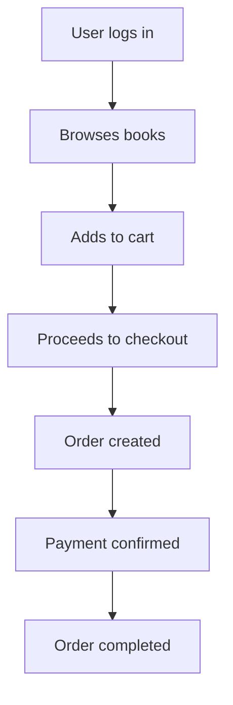

# Activity Diagram (Checkout Flow)

```mermaid
flowchart TD
    A[User logs in] --> B[Browses books]
    B --> C[Adds to cart]
    C --> D[Proceeds to checkout]
    D --> E[Order created]
    E --> F[Payment confirmed]              
    F --> G[Order completed]
```

