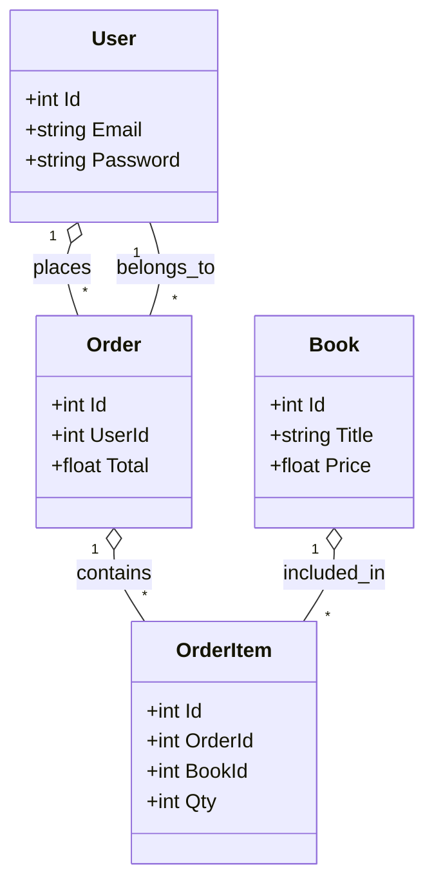

# Class Diagram 

```mermaid
classDiagram
	class Book {
		+int Id
		+string Title
		+float Price
	}

	class User {
		+int Id
		+string Email
		+string Password
	}

	class Order {
		+int Id
		+int UserId
		+float Total
	}

	class OrderItem {
		+int Id
		+int OrderId
		+int BookId
		+int Qty
	}

	Order "1" o-- "*" OrderItem : contains
	Book "1" o-- "*" OrderItem : included_in
	User "1" o-- "*" Order : places
	Order "*" -- "1" User : belongs_to
```

Notes:
- Aggregation between `Order` and `OrderItem` is represented using `o--`.
- Render this file in a Markdown viewer that supports Mermaid to see the diagram.