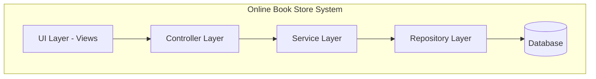

# Component Diagram

## Components:
- **UI Layer (Views)** - User interface and presentation layer
- **Controller Layer** - Handles HTTP requests and responses
- **Service Layer** - Business logic and operations
- **Repository Layer** - Data access abstraction
- **Database** - Data storage and persistence

**Dependencies:** UI → Controller → Service → Repository → DB

