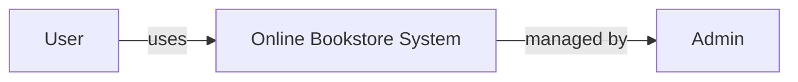
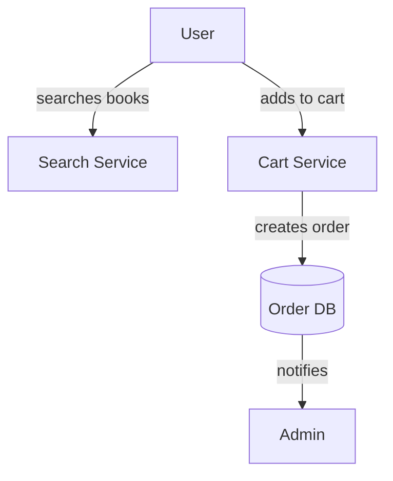

# Data Flow Diagram

## Context-Level
User → System → Admin

## Level 1 Flows

```mermaid
flowchart LR
	User[User] -->|uses| System[Online Bookstore System]
	System -->|managed by| Admin[Admin]
```

## Level 1 Flows

```mermaid
flowchart TB
	User[User]
	Search[Search Service]
	Cart[Cart Service]
	OrderDB[(Order DB)]
	Admin[Admin]

	User -->|searches books| Search
	User -->|adds to cart| Cart
	Cart -->|creates order| OrderDB
	OrderDB -->|notifies| Admin
```

- User searches books
- User adds to cart
- System stores order data

---

