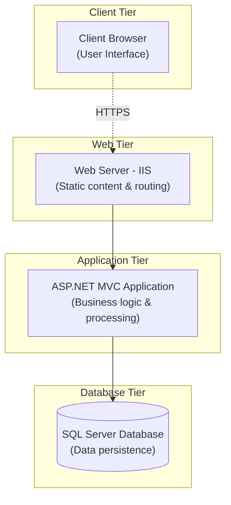

# Deployment Diagram

## Architecture Components:
- **Client Browser** - User interface
- **Web Server (IIS)** - Handles HTTP requests and static content
- **Application (ASP.NET MVC)** - Business logic and processing
- **SQL Server Database** - Data storage and persistence

**Connections:** All communications via HTTPS for security

