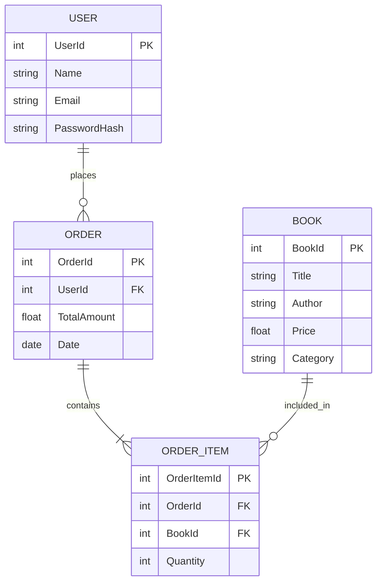

# ERD Description

Entities:

Relationships:

# ERD Description (Mermaid)

Notes:
- Table names are uppercased to avoid reserved-keyword collisions (e.g., `order`).
- Render this file in a Markdown viewer that supports Mermaid to see the diagram.