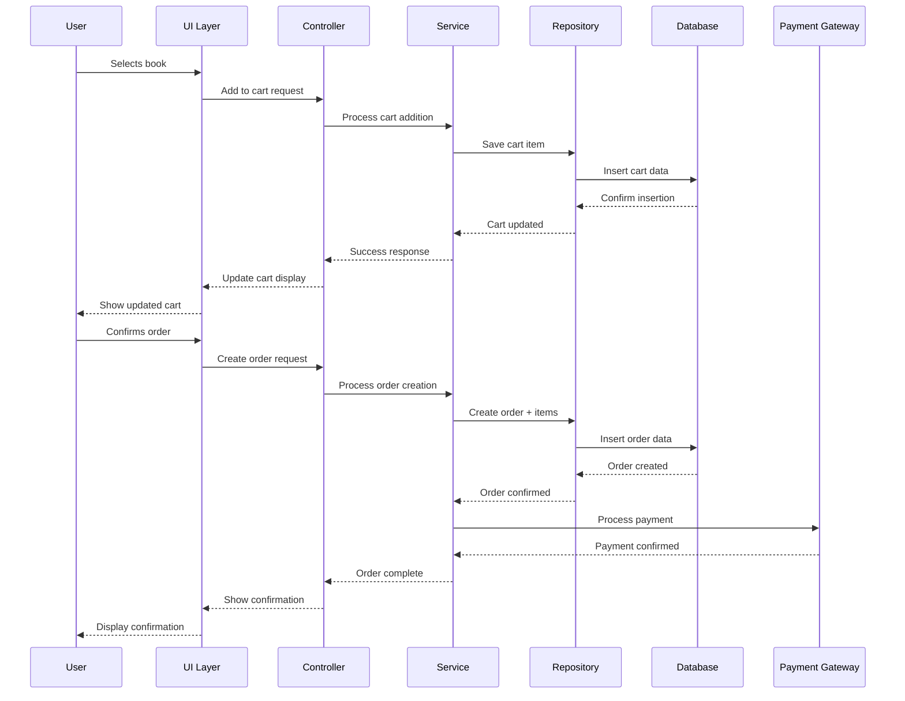

# Sequence Diagram - User Checkout Flow

```mermaid
sequenceDiagram
    participant User
    participant UI as UI Layer
    participant Controller
    participant Service
    participant Repository
    participant DB as Database
    participant Payment as Payment Gateway
    
    User->>UI: Selects book
    UI->>Controller: Add to cart request
    Controller->>Service: Process cart addition
    Service->>Repository: Save cart item
    Repository->>DB: Insert cart data
    DB-->>Repository: Confirm insertion
    Repository-->>Service: Cart updated
    Service-->>Controller: Success response
    Controller-->>UI: Update cart display
    UI-->>User: Show updated cart
    
    User->>UI: Confirms order
    UI->>Controller: Create order request
    Controller->>Service: Process order creation
    Service->>Repository: Create order + items
    Repository->>DB: Insert order data
    DB-->>Repository: Order created
    Repository-->>Service: Order confirmed
    Service->>Payment: Process payment
    Payment-->>Service: Payment confirmed
    Service-->>Controller: Order complete
    Controller-->>UI: Show confirmation
    UI-->>User: Display confirmation
```

