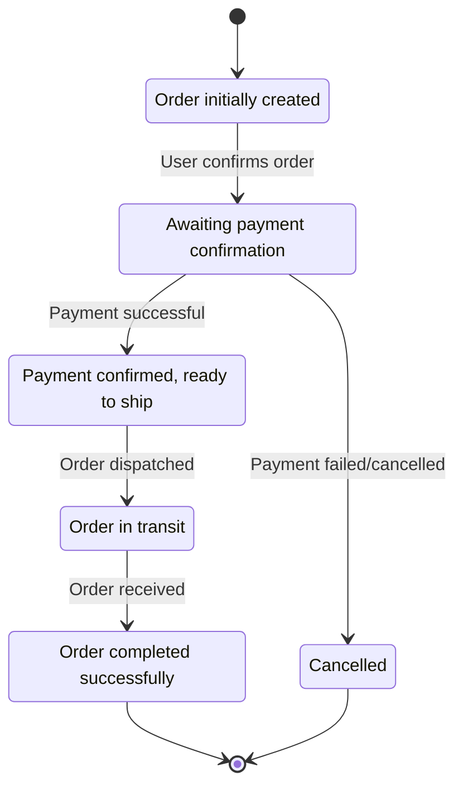

# State Diagram - Order States

## Order States Flow:
- **Created** → **Pending Payment** → **Paid** → **Shipped** → **Delivered**
- Alternative path: **Pending Payment** → **Cancelled** (if payment fails)